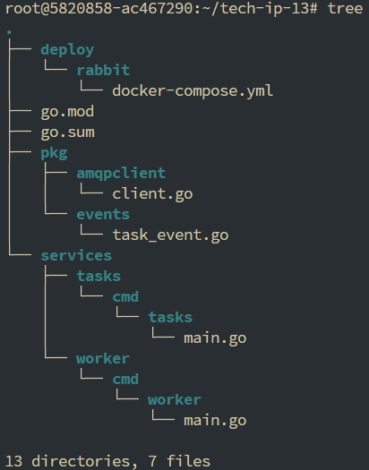
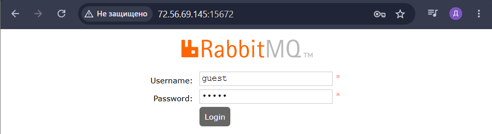
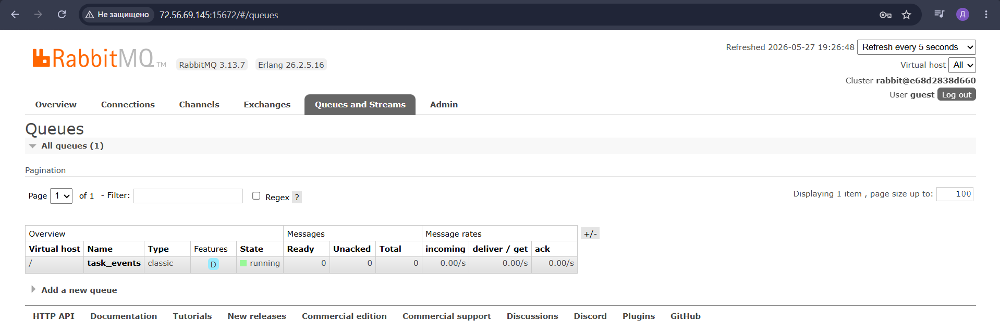
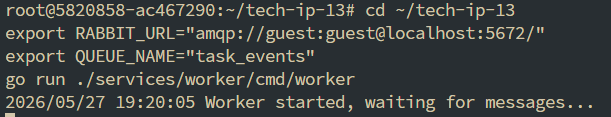
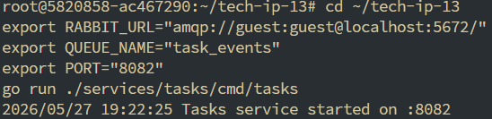
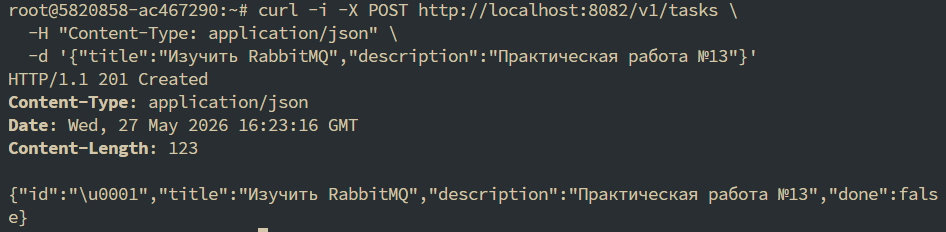
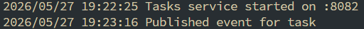
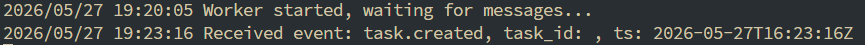

# Практическое занятие №13: RabbitMQ – отправка и получение сообщений

## Описание

Реализована асинхронная коммуникация между сервисами через **RabbitMQ**.  
При создании задачи сервис `tasks` публикует событие `task.created` в очередь `task_events`.  
Отдельный worker‑процесс читает сообщения из очереди, логирует их и подтверждает обработку (ack).

**Producer** – сервис `tasks` (HTTP на порту 8082)  
**Consumer** – worker (читает очередь `task_events`)

---

## Технологии

- **Go** 1.21+
- **RabbitMQ** (брокер сообщений)
- **Docker Compose** (запуск RabbitMQ)
- **amqp091-go** – клиент для RabbitMQ

---

## Структура проекта




---

## Запуск

### 1. Запустить RabbitMQ

```bash
cd deploy/rabbit
docker compose up -d
```



### 2. Запустить worker (consumer)


### 3. Запустить сервис tasks (producer)


### Проверка работы


### Логи сервиса tasks


### Логи worker


### Проверка очереди в Management UI


